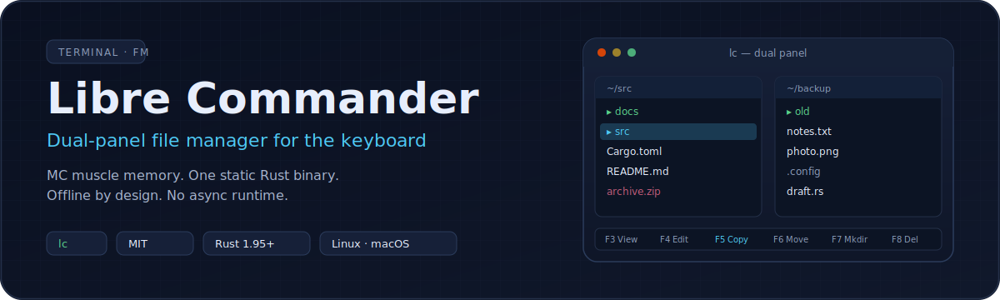
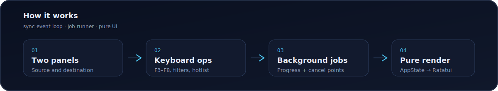

<p align="center">
  
</p>

<p align="center">
  <a href="https://github.com/leszek3737/LibreCommander/actions/workflows/rust.yml"></a>
  <a href="https://crates.io/crates/librecommander"></a>
  <a href="LICENSE"></a>
  <a href="https://www.rust-lang.org/"></a>
  <a href="https://doc.rust-lang.org/edition-guide/"></a>
  <a href="#supported-platforms"></a>
  <a href="https://ratatui.rs/"></a>
</p>

**Modern dual-panel MC for people who want Norton/MC muscle memory in a single
offline Rust binary — no async runtime, `forbid(unsafe)`, zip-safe archives.**

Binary name: `lc` (**L**ibre **C**ommander). crates.io package: `librecommander`
(`lc` is taken).

```bash
cargo install librecommander
lc
```

---

## Proof

<p align="center">
  
</p>

<p align="center">
  
</p>

---

## Why `lc`

<p align="center">
  
</p>

| | Libre Commander | Midnight Commander | ranger / yazi |
|---|---|---|---|
| Panel model | Dual-panel (MC-style) | Dual-panel | Single-pane + preview |
| Runtime | Sync, no async runtime | C | ranger: Python · yazi: async Tokio |
| Binary | One static binary | system pkg | ranger: script · yazi: binary |
| Network | Offline by design | — | yazi: fetches previews |
| `unsafe` | `forbid` crate-wide | — | — |
| Config | TOML | INI | Python / TOML |

MC dual-panel muscle memory in a deterministic Rust binary that stays offline
and refuses unsafe code.

---

## Features

**Workflow** — dual panels, expandable directory tree, directory compare (3 modes),
hotlist (`Alt+1`…`Alt+9`), history (`Alt+Backspace`), quick cd (`Alt+C`), long/brief
listings, mouse (click, double-click, drag-select).

**File ops** — copy / move / delete / rename / `chmod` as cancellable background jobs
with live progress; symlink-as-symlink, no-clobber chunked copy, cross-device
copy+delete fallback, partial-copy cleanup; refuses critical system paths;
`F4` opens `$EDITOR`.

**Archives** — browse, extract, create: `zip`, `tar`, `tar.gz`, `tar.bz2`, `tar.xz`,
`tar.zst` (read+write); `7z` read-only. Zip-slip protection, size limits,
symlink-safe extraction.

**Search & view** — incremental glob filter, recursive find, grep-like content
search, built-in viewer (text / hex / image via `chafa`, in-file search, wrap,
line numbers).

**Polish** — emoji / ASCII / Nerd Font icon themes, file-type colors, auto-refresh
watcher (keeps filter/sort/selection), 12 sort modes, MC-compatible user menu
(`.mc.menu`).

---

<p align="center">
  
</p>

### Install

**crates.io (binary `lc`):**

```bash
cargo install librecommander
```

**Prebuilt release binaries** (Linux x86_64 / aarch64, macOS arm64 / x86_64):
[GitHub Releases](https://github.com/leszek3737/LibreCommander/releases).

**From git / source:**

```bash
cargo install --git https://github.com/leszek3737/LibreCommander
# or:
git clone https://github.com/leszek3737/LibreCommander.git
cd LibreCommander
cargo build --release    # target/release/lc
cargo install --path .
```

### First run

```bash
lc
```

No CLI flags required. Config lives at `~/.config/lc/config.toml`.

**Optional — image preview:** `lc` shells out to
[`chafa`](https://hpjansson.org/chafa/) (not bundled):

```bash
# macOS
brew install chafa
# Debian / Ubuntu
sudo apt install chafa
# Fedora
sudo dnf install chafa
# Arch
sudo pacman -S chafa
```

Without `chafa`, image view shows `Failed to execute chafa (is it installed?)`.

### 30-second cheatsheet

| Key | Action | | Key | Action |
|-----|--------|-|-----|--------|
| `Tab` | Switch panel | | `F3` | View / preview |
| `h j k l` / arrows | Move | | `F4` | Edit (`$EDITOR`) |
| `Enter` | Open dir / archive | | `F5` | Copy |
| `Alt+Backspace` | History back | | `F6` | Move |
| `Ctrl+H` | Toggle hidden | | `F7` | Mkdir / extract |
| `Alt+C` | Quick cd | | `F8` | Delete |
| `Alt+1`…`Alt+9` | Hotlist | | `F10` / `q` | Quit |

Press **`F1`** any time for in-app help.

---

## Keyboard reference

<details>
<summary><b>General · Navigation · File ops · Search · Panels · Viewer · Tree · CLI · Menu · Mouse</b></summary>

### General

| Key | Action |
|-----|--------|
| `F1` | Help dialog |
| `F2` | User menu |
| `F9` | Menu bar |
| `F10` / `q` | Quit |
| `Alt+X` | Command line |

### Navigation

| Key | Action |
|-----|--------|
| `Tab` | Switch between panels |
| `↑` / `k` | Move up |
| `↓` / `j` | Move down |
| `Enter` | Open directory / preview archive |
| `Alt+Backspace` | Previous directory (history) |
| `Home` / `End` | First / last entry |
| `PageUp` / `PageDown` | Page up / down |
| `Alt+C` | Quick cd dialog |

### File operations

| Key | Action |
|-----|--------|
| `F3` | View file / preview archive |
| `F4` | Edit (`$EDITOR`) |
| `F5` | Copy |
| `F6` | Move |
| `F7` | Create directory / extract archive |
| `F8` | Delete |
| `F11` | Rename |
| `F12` | Archive menu |
| `Alt+Enter` | Properties |
| `Insert` | Toggle selection |
| `Shift+↑` / `Shift+↓` | Extend selection |
| `Ctrl+R` | Refresh panel |
| `Ctrl+O` | External viewer (exit to shell temporarily) |

Also from `F9`: **File → Rename**, **File → Chmod**.

### Search & filter

| Key | Action |
|-----|--------|
| Type any key | Incremental filter |
| `Ctrl+S` | Search mode |
| `Esc` | Cancel / clear filter |
| `Enter` | Confirm search |

### Panel & view

| Key | Action |
|-----|--------|
| `Ctrl+U` | Swap panels |
| `Ctrl+H` | Toggle hidden files |

### Bookmarks & history

| Key | Action |
|-----|--------|
| `Alt+1` … `Alt+9` | Hotlist slot 1–9 |

### File viewer

| Key | Action |
|-----|--------|
| `Esc` / `F3` / `F10` / `q` | Exit |
| `↑` `↓` `j` `k` / PgUp / PgDn / Home / End | Scroll |
| `Left` / `Right` | Horizontal scroll |
| `l` | Line numbers |
| `w` | Word wrap |
| `h` | Hex mode |
| `/` | Search in file |
| `n` / `N` | Next / previous match |

### Directory tree

| Key | Action |
|-----|--------|
| `Esc` | Exit tree |
| arrows / Home / End / PgUp / PgDn | Navigate |
| `Enter` | Expand/collapse or view file |
| `c` | `cd` to selected directory |

### Command line (`Alt+X`)

| Key | Action |
|-----|--------|
| `Esc` | Cancel |
| `Enter` | Run via shell |
| `↑` / `↓` | History |
| `Ctrl+A` / `Ctrl+E` | Line start / end |
| `Ctrl+W` | Delete word |
| `Ctrl+U` | Delete to start |
| `Ctrl+C` | Cancel |

### Menu bar (`F9`)

| Key | Action |
|-----|--------|
| `←` / `→` | Category |
| `↑` / `↓` | Items |
| `Enter` | Execute |
| `Esc` / `F9` | Close |

### List picker (history, hotlist, user menu)

| Key | Action |
|-----|--------|
| `↑` / `↓` | Navigate |
| `Enter` | Select |
| `Esc` | Close |
| `a` / `d` | Add / delete hotlist entry (hotlist only) |

### Mouse

| Action | Effect |
|--------|--------|
| Left click file | Select |
| Left double-click | Open / view |
| Left click panel | Activate panel |
| Left drag | Select range |
| Middle click | Copy (`F5`) |
| Right click | Cancel (`Esc`) |
| Scroll | Move cursor |
| Click function bar | `F1`–`F10` |

</details>

---

## Configuration

**Path:** `~/.config/lc/config.toml` (or `$XDG_CONFIG_HOME/lc/config.toml`)

```toml
active_panel   = "left"   # "left" or "right"
dir_first      = true
sort_sensitive = false

[left]
path             = "/home/user"
show_hidden      = true
show_permissions = false
listing_mode     = "long"      # "long" or "brief"
sort_mode        = "name_asc"
filter           = ""

[right]
path             = "/home/user/projects"
show_hidden      = true
show_permissions = false
listing_mode     = "long"
sort_mode        = "name_asc"
filter           = ""

hotlist = ["/home/user", "/home/user/projects"]
```

### Sort modes

`name_asc`, `name_desc`, `natural_name_asc`, `natural_name_desc`, `size_asc`,
`size_desc`, `mod_time_asc`, `mod_time_desc`, `btime_asc`, `btime_desc`,
`extension_asc`, `extension_desc`

Cycle via **Left/Right → Sort order**. Rules: `..` first, dirs before files,
case-insensitive by default (`dir_first`, `sort_sensitive`). Natural sort treats
digit runs numerically (`file9` < `file10`).

### Theming

```toml
[theme]
icon_theme   = "emoji"      # "emoji", "ascii", or "nerd_font"
panel_bg     = "navy"
panel_fg     = "white"
highlight_bg = "cyan"
highlight_fg = "black"
directory    = "white"
executable   = "green"
symlink      = "cyan"
archive      = "red"
image        = "magenta"
video        = "light_magenta"
audio        = "light_green"
source_code  = "yellow"
config       = "light_blue"
regular_file = "white"
```

Colors: named (`red`, `navy`), hex (`#RRGGBB` / `#RGB`), or ANSI `0–255`.

### Environment

| Variable | Purpose | Default |
|----------|---------|---------|
| `EDITOR` | External editor (`F4`) | `vi` |
| `HOME` | Config / menu location | required |
| `XDG_CONFIG_HOME` | Config base | `$HOME/.config` |

---

## Archives

| Format | Extension | Read | Write |
|--------|-----------|:----:|:-----:|
| ZIP | `.zip` | ✅ | ✅ |
| TAR | `.tar` | ✅ | ✅ |
| TAR+Gzip | `.tar.gz`, `.tgz` | ✅ | ✅ |
| TAR+Bzip2 | `.tar.bz2`, `.tbz`, `.tbz2` | ✅ | ✅ |
| TAR+XZ | `.tar.xz`, `.txz` | ✅ | ✅ |
| TAR+Zstd | `.tar.zst`, `.tzst` | ✅ | ✅ |
| 7z | `.7z` | ✅ | ❌ |

| Key | Action |
|-----|--------|
| `Enter` / `F3` on archive | Preview contents |
| `F7` on archive | Extract |
| `F12` | Archive menu (extract / create) |
| `F12` + selection | Create archive from selection |

Extract/create dialogs pick destination or name/format. Jobs run in the
background with progress and cancel. Extraction validates paths against
[zip-slip](https://snyk.io/research/zip-slip-vulnerability), enforces size
limits, and handles symlinks safely.

---

## File viewer & image preview

Built-in viewer (`F3`):

- Text with wrap (`w`) and line numbers (`l`)
- Hex dump (`h`) — 16 bytes/line
- Image preview — MIME detect → `chafa` character art via `ansi-to-tui`
- In-file search (`/`, `n` / `N`)
- Horizontal scroll, Unicode (lossy UTF-8 for binary)
- Auto content detection (MIME + null-byte fallback)

Limit: files up to 100 MiB (larger truncated). On first view and on resize,
`lc` runs `chafa --size WxH <file>`; output is cached so later frames only clone
the buffer.

---

## Search & filter

**Incremental filter** — type in normal mode; glob (`*`, `?`), case-insensitive.

**Find file** — **Menu → Command → Find file**. Recursive glob from active panel;
jumps to first match.

**Content search** — line-by-line, case-insensitive. Limits: skip files > 10 MiB,
lines > 64 KiB; max 1000 results, depth 20, 10 000 items scanned.
*(UI wiring still open — see [issues](https://github.com/leszek3737/LibreCommander/issues).)*

---

## Directory compare

**Command menu → Compare dirs**

| Mode | Matching |
|------|----------|
| Quick | Filename + entry type |
| Size | Filename + size (dirs: name + type) |
| Thorough | Filename + size + mtime (dirs: name + type) |

Differing / unique entries are selected in both panels.

---

## User menu

- **Local:** `.mc.menu` in the active panel directory
- **Global:** `~/.config/lc/menu`

```
# Comment

+ f \.rs$
T  Run Rust tests
	cargo test %f

+ f \.py$
R  Run Python script
	python3 %f

A  Archive selected files
	tar czf archive.tgz %t

D  Diff panels
	diff -rq %d %D
```

- **Hotkey:** first character of the title line
- **Body:** indented shell lines
- **Condition:** `+ f <regex>` — show when filename matches (OR across lines)

| Token | Expands to |
|-------|------------|
| `%f` | Current filename (shell-quoted) |
| `%d` / `%D` | Active / other panel directory |
| `%t` / `%s` | Tagged files (space-separated, quoted); `%s` ≡ `%t` |
| `%%` | Literal `%` |

Commands: `sh -c` in the active panel directory. Menu files capped at 1 MiB.

---

## File operation safety

Long copy / move / delete jobs run in the background with item + byte progress
and cancel between safe boundaries.

- Chunked copies do **not** overwrite existing destinations by default
- Conflicts ask before overwrite
- Recursive copies go through a temporary sibling; partial output cleaned on
  fail/cancel
- Symlinks copied/deleted **as symlinks** (targets not followed)
- Cross-device move = copy then delete **only after** copy succeeds
- Critical system directories protected from delete
- Terminal restored even on panic (`TerminalGuard`)

---

## FAQ & troubleshooting

**Image preview: "Failed to execute chafa".**  
Install [`chafa`](https://hpjansson.org/chafa/) — not bundled.

**Colors wrong / no truecolor.**  
Set `COLORTERM=truecolor`. Legacy 8-color terminals stay flat.

**Icons are boxes / `?`.**  
Font missing glyphs → `icon_theme = "ascii"` or install a
[Nerd Font](https://www.nerdfonts.com/) + `icon_theme = "nerd_font"`.

**Where is config?**  
`~/.config/lc/config.toml`. Edit directly — no silent migration.

**Windows?**  
Not yet. CI is Linux + macOS. Watcher uses platform `notify` (macOS:
`macos_fsevent`).

**Default desktop file manager?**  
No — terminal app, not for `xdg-open`.

**Crash / wrong behavior.**  
Open an issue with repro, OS, terminal, Rust version — see
[Contributing](#contributing).

---

## Supported platforms

| OS | Status | Notes |
|----|:------:|-------|
| Linux | ✅ CI-tested | Primary target |
| macOS | ✅ CI-tested | `macos_fsevent` watcher |
| Windows | ❌ Not yet | Help wanted |
| BSDs | ⚠️ Untested | May work; please report |

Requires **Rust 1.95+** (edition 2024).

---

## Contributing

Read **[CONTRIBUTING.md](CONTRIBUTING.md)** for style, tests, and the merge gate.

```bash
cargo fmt
cargo clippy --locked --all-targets -- -D warnings
cargo test --locked
cargo build --release --locked
```

Ideas: [open issues](https://github.com/leszek3737/LibreCommander/issues). Large
changes — open an issue first.

---

## Acknowledgments

- **[Midnight Commander](https://midnight-commander.org/)** — dual-panel workflow
- **[Yazi](https://github.com/sxyazi/yazi)** — some components adapted by
  [Sxyazi](https://github.com/sxyazi) (MIT)
- **[Rust](https://www.rust-lang.org/)** · **[Ratatui](https://ratatui.rs/)** ·
  **[Crossterm](https://github.com/crossterm-rs/crossterm)** ·
  **[chafa](https://hpjansson.org/chafa/)**

---

## License

[MIT](LICENSE) © 2026 Leszek3737
