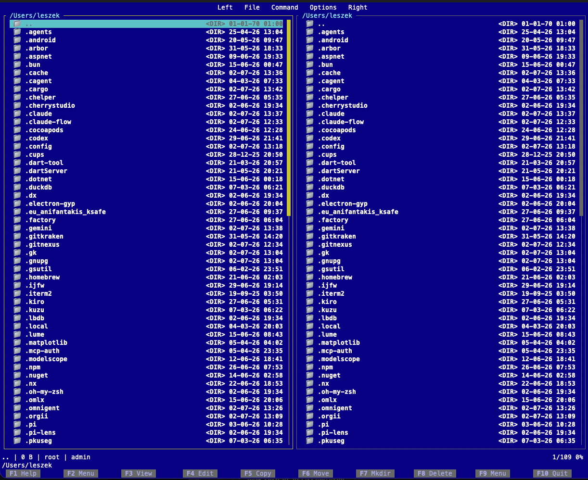
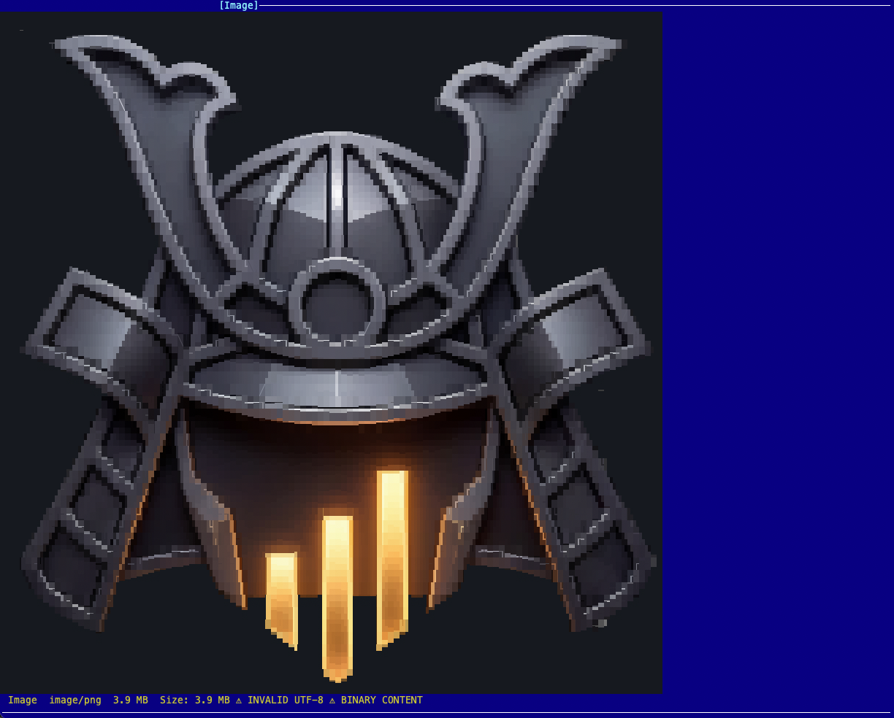

<div align="center">

# 🦀 Libre Commander

**A fast, keyboard-driven, dual-panel terminal file manager — inspired by Midnight Commander.**

[](https://github.com/leszek3737/LibreCommander/actions/workflows/rust.yml)
[](LICENSE)
[](https://www.rust-lang.org/)
[](https://doc.rust-lang.org/edition-guide/)
[](#supported-platforms)
[](https://ratatui.rs/)

</div>

Libre Commander (`lc`) brings the classic two-pane file-manager workflow to a
modern, async-free Rust core. Copy, move, browse archives, preview images, and
search files — all without leaving the keyboard. One static binary, fully
offline, no runtime dependencies.

> 💬 `lc` is short for **L**ibre **C**ommander.

<p align="center">
  
</p>

---

## Table of Contents

- [Features](#features)
- [Quick Start](#quick-start)
  - [Install](#install)
  - [First Run](#first-run)
  - [30-Second Cheatsheet](#30-second-cheatsheet)
- [Keyboard Reference](#keyboard-reference)
- [Configuration](#configuration)
- [Archives](#archives)
- [File Viewer & Image Preview](#file-viewer--image-preview)
- [Search & Filter](#search--filter)
- [Sorting](#sorting)
- [Directory Compare](#directory-compare)
- [User Menu](#user-menu)
- [FAQ & Troubleshooting](#faq--troubleshooting)
- [Supported Platforms](#supported-platforms)
- [Contributing](#contributing)
- [Acknowledgments](#acknowledgments)
- [License](#license)

---

## Features

**Workflow**
- **Dual-panel interface** — navigate and manage files in two panels side-by-side
- **Directory tree** — interactive expandable tree view
- **Directory compare** — diff panels by name, size, or modification time (3 modes)
- **Directory hotlist** — bookmark directories via `Alt+1` … `Alt+9`
- **Directory history** — jump back with `Alt+Backspace`
- **Quick cd** — jump to any path with `Alt+C`
- **Panel views** — Long (detailed) and Brief (compact) listing modes
- **Mouse support** — click to select, double-click to open, drag to select ranges

**File operations**
- **Async, cancellable jobs** — copy, move, delete, rename, `chmod` with live byte/item progress
- **Safe recursive ops** — symlink preservation, no-clobber copy, cross-device fallback, partial-copy cleanup
- **System protection** — refuses to delete critical directories (`/`, `/etc`, `/usr`, …)
- **External editor** — `F4` opens files in `$EDITOR`

**Archives** — browse, extract, and create (see [Archives](#archives))
- Read **and** write: `zip`, `tar`, `tar.gz`, `tar.bz2`, `tar.xz`, `tar.zst`
- Read-only: `7z`
- Zip-slip protection, size limits, symlink-safe extraction

**Search & view**
- **Incremental filter** — type to filter the panel in real time (glob patterns)
- **Recursive file search** — glob-pattern find with auto-navigation to first match
- **Content search** — grep-like, line-by-line
- **Built-in viewer** — text + hex dump + image preview, in-file search, word wrap, line numbers

**Polish**
- **File-type icons & colors** — emoji/ASCII/Nerd-Font themes for archives, images, code, audio, video, config
- **File watcher** — auto-refresh on external changes, preserving filters, sort, and selection
- **12 sort modes** — name, natural, size, mtime, btime, extension (asc/desc)
- **MC-compatible user menu** — `.mc.menu` / `~/.config/lc/menu` with conditionals and substitution tokens

<details>
<summary><b>Why <code>lc</code> over ranger / yazi / mc?</b></summary>

| | Libre Commander | Midnight Commander | ranger / yazi |
|---|---|---|---|
| Panel model | Dual-panel (MC-style) | Dual-panel | Single-pane + preview |
| Runtime | Sync, no async runtime | C | ranger: Python · yazi: async Tokio |
| Binary | One static binary | system pkg | ranger: script · yazi: binary |
| Network | Offline by design | — | yazi: fetches previews |
| `unsafe` | `forbid` crate-wide | — | — |
| Config | TOML | INI | Python / TOML |

`lc` is for people who want the **MC dual-panel muscle memory**, in a **single
deterministic Rust binary** that runs offline and refuses to do anything unsafe.
</details>

---

## Quick Start

### Install

**Option A — one command (any OS, from git):**

```bash
cargo install --git https://github.com/leszek3737/LibreCommander
```

Puts the `lc` binary on your `PATH` (`~/.cargo/bin`). Requires Rust 1.95+.

**Option B — build from source:**

```bash
git clone https://github.com/leszek3737/LibreCommander.git
cd LibreCommander
cargo build --release    # binary: target/release/lc
# or install it on your PATH:
cargo install --path .
```

> Prebuilt binaries and Homebrew/apt packages are not published yet — track
> [issues](https://github.com/leszek3737/LibreCommander/issues) if you'd like to
> help package `lc` for your distro.

### First Run

```bash
lc
```

That's it — `lc` opens with both panels and a default config. There are no CLI
flags to learn; everything is driven from the keyboard and `~/.config/lc/config.toml`.

**Optional — enable image preview:** `lc` renders images as character art via
[`chafa`](https://hpjansson.org/chafa/), which is **not** bundled:

```bash
# macOS
brew install chafa
# Debian / Ubuntu
sudo apt install chafa
# Fedora
sudo dnf install chafa
# Arch
sudo pacman -S chafa
```

If `chafa` is missing, opening an image in the viewer shows
`Failed to execute chafa (is it installed?)` — install it to enable preview.

### 30-Second Cheatsheet

| Key | Action | | Key | Action |
|-----|--------|-|-----|--------|
| `Tab` | Switch panel | | `F3` | View / preview |
| `h j k l` / arrows | Move | | `F4` | Edit (`$EDITOR`) |
| `Enter` | Open dir / archive | | `F5` | Copy |
| `Alt+Backspace` | History back | | `F6` | Move |
| `Ctrl+H` | Toggle hidden | | `F7` | Mkdir / extract |
| `Alt+C` | Quick cd | | `F8` | Delete |
| `Alt+1`…`Alt+9` | Hotlist | | `F10` / `q` | Quit |

Press **`F1`** any time for the in-app help dialog.

---

## Keyboard Reference

### General

| Key | Action |
|-----|--------|
| `F1` | Help dialog |
| `F2` | User menu |
| `F9` | Menu bar |
| `F10` / `q` | Quit |
| `Alt+X` | Command line |

### Navigation

| Key | Action |
|-----|--------|
| `Tab` | Switch between panels |
| `↑` / `k` | Move up |
| `↓` / `j` | Move down |
| `Enter` | Open directory / preview archive |
| `Alt+Backspace` | Go to previous directory (history) |
| `Home` | Go to first entry |
| `End` | Go to last entry |
| `PageUp` | Page up |
| `PageDown` | Page down |
| `Alt+C` | Quick cd dialog (enter path directly) |

### File Operations

| Key | Action |
|-----|--------|
| `F3` | View file / preview archive contents |
| `F4` | Edit file (opens in `$EDITOR`) |
| `F5` | Copy file(s) |
| `F6` | Move file(s) |
| `F7` | Create directory / extract archive |
| `F8` | Delete file(s) |
| `F11` | Rename file or directory |
| `F12` | Archive operations menu |
| `Alt+Enter` | Show file properties |
| `Insert` | Toggle file selection |
| `Shift+↑` | Extend selection upward |
| `Shift+↓` | Extend selection downward |
| `Ctrl+R` | Refresh current panel |
| `Ctrl+O` | External viewer (temporarily exit to shell) |

Additional actions are available from the `F9` menu: **File → Rename** and **File → Chmod**.

### Search & Filter

| Key | Action |
|-----|--------|
| Type any key | Incremental search (filter files) |
| `Ctrl+S` | Enter search mode |
| `Esc` | Cancel search / clear filter |
| `Enter` | Confirm search |

### Panel & View

| Key | Action |
|-----|--------|
| `Ctrl+U` | Swap panels |
| `Ctrl+H` | Toggle hidden files |

### Bookmarks & History

| Key | Action |
|-----|--------|
| `Alt+1` … `Alt+9` | Jump to directory hotlist slot 1–9 |
| `Mouse click` | Select file / switch panel |
| `Mouse double-click` | Open directory / view file |

### File Viewer Mode

| Key | Action |
|-----|--------|
| `Esc` / `F3` / `F10` / `q` | Exit viewer |
| `↑` / `k` | Scroll up |
| `↓` / `j` | Scroll down |
| `PageUp` / `PageDown` | Page up/down |
| `Home` / `End` | Go to top/bottom |
| `Left` / `Right` | Horizontal scroll |
| `l` | Toggle line numbers |
| `w` | Toggle word wrap |
| `h` | Toggle hex mode |
| `/` | Search in file |
| `n` / `N` | Next / previous search match |

### Directory Tree Mode

| Key | Action |
|-----|--------|
| `Esc` | Exit tree |
| `↑` / `↓` / `Home` / `End` / `PageUp` / `PageDown` | Navigate |
| `Enter` | Expand/collapse directory or view file |
| `c` | `cd` to selected directory |

### Command Line Mode

Enter with `Alt+X` or **Menu → Command → Command line**.

| Key | Action |
|-----|--------|
| `Esc` | Cancel command line |
| `Enter` | Execute shell command |
| `↑` / `↓` | Browse command history |
| `Backspace` | Delete character |
| `Ctrl+A` | Move to line start |
| `Ctrl+E` | Move to line end |
| `Ctrl+W` | Delete word |
| `Ctrl+U` | Delete to line start |
| `Ctrl+C` | Cancel command line |

### Menu Bar (`F9`)

| Key | Action |
|-----|--------|
| `←` / `→` | Switch menu category |
| `↑` / `↓` | Navigate items |
| `Enter` | Execute action |
| `Esc` / `F9` | Close menu |

### List Picker (History, Hotlist, User Menu)

| Key | Action |
|-----|--------|
| `↑` / `↓` | Navigate |
| `Enter` | Select / execute |
| `Esc` | Close |
| `a` | Add to hotlist (hotlist picker only) |
| `d` | Delete from hotlist (hotlist picker only) |

### Mouse

| Action | Effect |
|--------|--------|
| Left click on file | Select entry |
| Left double-click | Open directory or view file |
| Left click on panel | Switch active panel |
| Left drag in panel | Select range of entries |
| Middle click | Copy (`F5` equivalent) |
| Right click | Cancel / close (`Esc` equivalent) |
| Scroll | Scroll panel cursor |
| Click function bar (bottom) | `F1`–`F10` actions |

---

## Configuration

Config location: **`~/.config/lc/config.toml`**

```toml
active_panel   = "left"   # "left" or "right"
dir_first      = true     # directories before files in sort
sort_sensitive = false    # case-sensitive name sorting

[left]
path             = "/home/user"
show_hidden      = true
show_permissions = false
listing_mode     = "long"      # "long" or "brief"
sort_mode        = "name_asc"  # see Sort Modes below
filter           = ""          # glob pattern, empty = no filter

[right]
path             = "/home/user/projects"
show_hidden      = true
show_permissions = false
listing_mode     = "long"
sort_mode        = "name_asc"
filter           = ""

hotlist = ["/home/user", "/home/user/projects"]
```

### Sort Modes

`name_asc`, `name_desc`, `natural_name_asc`, `natural_name_desc`, `size_asc`,
`size_desc`, `mod_time_asc`, `mod_time_desc`, `btime_asc`, `btime_desc`,
`extension_asc`, `extension_desc`

### Theming

An optional `[theme]` section customizes colors. All fields have defaults.

```toml
[theme]
icon_theme   = "emoji"      # "emoji", "ascii", or "nerd_font"
panel_bg     = "navy"
panel_fg     = "white"
highlight_bg = "cyan"
highlight_fg = "black"
directory    = "white"
executable   = "green"
symlink      = "cyan"
archive      = "red"
image        = "magenta"
video        = "light_magenta"
audio        = "light_green"
source_code  = "yellow"
config       = "light_blue"
regular_file = "white"
```

Color values accept **named colors** (`red`, `light_blue`, `navy`), **hex**
(`#RRGGBB` or `#RGB`), or **0–255 ANSI** indexes.

### Environment Variables

| Variable | Purpose | Default |
|----------|---------|---------|
| `EDITOR` | External editor for `F4` | `vi` |
| `HOME` | Config/menu file location | (required) |
| `XDG_CONFIG_HOME` | Config/menu file base directory | `$HOME/.config` |

---

## Archives

`lc` browses, extracts, and creates archives.

| Format | Extension | Read | Write |
|--------|-----------|:----:|:-----:|
| ZIP | `.zip` | ✅ | ✅ |
| TAR | `.tar` | ✅ | ✅ |
| TAR+Gzip | `.tar.gz`, `.tgz` | ✅ | ✅ |
| TAR+Bzip2 | `.tar.bz2`, `.tbz`, `.tbz2` | ✅ | ✅ |
| TAR+XZ | `.tar.xz`, `.txz` | ✅ | ✅ |
| TAR+Zstd | `.tar.zst`, `.tzst` | ✅ | ✅ |
| 7z | `.7z` | ✅ | ❌ |

| Key | Action |
|-----|--------|
| `Enter` on archive | Preview archive contents |
| `F3` on archive | Preview archive contents |
| `F7` on archive | Extract archive |
| `F12` | Archive menu (extract / create) |
| `F12` with selected files | Create archive from selection |

The extract dialog lists archive contents and asks for the destination; the
create dialog picks the archive name and format (`zip`, `tar.gz`, `tar.xz`,
`tar`). All archive operations run in the background with progress and
cancellation.

**Safety:** extraction validates paths against [zip-slip](https://snyk.io/research/zip-slip-vulnerability),
enforces size limits, and handles symlinks safely.

---

## File Viewer & Image Preview

<p align="center">
  
</p>

The built-in viewer (`F3`) supports:

- **Text mode** with word wrap (`w`)
- **Line numbers** (`l`)
- **Hex dump** (`h`) — standard hex+offset, 16 bytes per line
- **Image preview** — auto-detected via MIME; rendered as character art through `chafa`
- **In-file search** (`/` to search, `n` / `N` to navigate)
- **Horizontal scrolling** for wide lines
- **Unicode** — lossy UTF-8 display for binary files
- **Auto content detection** — MIME-based with null-byte fallback

Limits: files up to 100 MiB (larger are truncated).

### Image preview in detail

On first view (and on terminal resize), `lc` spawns `chafa --size WxH <file>`
and parses its ANSI output into terminal cells via `ansi-to-tui`. The result is
cached — subsequent frames only clone the cached buffer, keeping rendering at
full speed. Preview size adapts to the terminal area.

---

## Search & Filter

**Incremental filter** — type any character in normal mode to filter the panel
in real time. Supports glob patterns (`*`, `?`), case-insensitive.

**Find file** — **Menu → Command → Find file**. Recursive glob search from the
active panel's directory; the first match is navigated to automatically.

**Content search** — grep-like, line-by-line, case-insensitive. Limits: files
over 10 MiB skipped, lines over 64 KiB skipped, max 1000 results, max depth 20,
max 10 000 items scanned. *(Not yet wired to a UI action — see
[issue tracker](https://github.com/leszek3737/LibreCommander/issues) for progress.)*

---

## Sorting

Twelve sort modes, cycled via **Left/Right → Sort order**:

| Mode | Key | Order |
|------|-----|-------|
| Name ↑ | `name_asc` | A–Z |
| Name ↓ | `name_desc` | Z–A |
| Nat ↑ | `natural_name_asc` | A–Z (digit-aware) |
| Nat ↓ | `natural_name_desc` | Z–A (digit-aware) |
| Size ↑ | `size_asc` | Smallest first |
| Size ↓ | `size_desc` | Largest first |
| Time ↑ | `mod_time_asc` | Oldest first |
| Time ↓ | `mod_time_desc` | Newest first |
| Created ↑ | `btime_asc` | Oldest first |
| Created ↓ | `btime_desc` | Newest first |
| Ext ↑ | `extension_asc` | A–Z |
| Ext ↓ | `extension_desc` | Z–A |

Rules: `..` always first, directories before files, case-insensitive. These
defaults are configurable via `dir_first` and `sort_sensitive` in `config.toml`.
Natural sort compares multi-digit runs numerically (`file9` < `file10`).

---

## Directory Compare

**Command menu → Compare dirs.** Three modes:

| Mode | Matching criteria |
|------|-------------------|
| Quick | Filename + entry type |
| Size | Filename + size (dirs: name + type only) |
| Thorough | Filename + size + modification time (dirs: name + type only) |

Differing and unique entries are auto-selected in both panels.

---

## User Menu

Create custom menu entries in:
- **Local:** `.mc.menu` in the active panel's directory
- **Global:** `~/.config/lc/menu`

### Format

```
# Comment line

+ f \.rs$
T  Run Rust tests
	cargo test %f

+ f \.py$
R  Run Python script
	python3 %f

A  Archive selected files
	tar czf archive.tgz %t

D  Diff panels
	diff -rq %d %D
```

- **Hotkey:** first character of the line (single char)
- **Title:** rest of the hotkey line (display label)
- **Body:** indented lines (tab or space) as shell commands
- **Condition:** `+ f <regex>` — only show the entry when the filename matches;
  multiple condition lines are OR'd; may appear before or after the hotkey line

### Substitution Tokens

| Token | Expands to |
|-------|------------|
| `%f` | Current filename (shell-quoted) |
| `%d` | Active panel directory (shell-quoted) |
| `%D` | Other panel directory (shell-quoted) |
| `%t` / `%s` | Tagged/selected files (space-separated, shell-quoted); `%s` is an alias for `%t` |
| `%%` | Literal `%` |

Commands run via `sh -c` with the active panel's directory as the working
directory. Menu files are limited to 1 MiB.

---

## File Operation Safety

Long-running copy, move, and delete operations run as background jobs with live
item and byte progress, and can be canceled between safe boundaries.

- Existing destinations are **not** overwritten by chunked copies.
- Copy/move conflicts show an overwrite confirmation before replacing.
- Recursive directory copies publish through a temporary sibling and clean up
  partial output on failure or cancellation.
- Symlinks are copied or deleted **as symlinks**, never by following their target.
- Cross-device moves fall back to copy-then-delete **only after** the copy succeeds.
- Critical system directories are protected from deletion.
- Terminal state is always restored — even on panic.

---

## FAQ & Troubleshooting

**Image preview shows "Failed to execute chafa".**
Install [`chafa`](https://hpjansson.org/chafa/) (see [First Run](#first-run)).
It is not bundled with `lc`.

**Colors look wrong / no truecolor.**
Set `COLORTERM=truecolor` in your shell. Most modern terminals enable it by
default; legacy 8-color terminals will look flat.

**Icons render as boxes / question marks.**
Your font lacks the glyphs. Use the `ascii` icon theme (no font dependency) or
install a [Nerd Font](https://www.nerdfonts.com/) and set `icon_theme = "nerd_font"`.

**Where is my config?**
`~/.config/lc/config.toml` (or `$XDG_CONFIG_HOME/lc/config.toml`). Edit it
directly — `lc` does not migrate config without your approval.

**Does `lc` support Windows?**
Not yet. The CI matrix covers **Linux and macOS**. The file watcher uses a
platform-specific `notify` backend (macOS: `macos_fsevent`).

**Can I make `lc` my default file manager?**
`lc` is a terminal application, not a desktop/GUI file manager. It is meant to
be launched from a terminal, not wired into `xdg-open`.

**It crashed / did something wrong.**
Please open an issue with the steps to reproduce, your OS, terminal, and Rust
version — see [Contributing](#contributing).

---

## Supported Platforms

| OS | Status | Notes |
|----|:------:|-------|
| Linux | ✅ CI-tested | Primary target |
| macOS | ✅ CI-tested | Watcher uses `macos_fsevent` backend |
| Windows | ❌ Not yet | Help wanted — see issues |
| BSDs | ⚠️ Untested | May work; please report |

Requires **Rust 1.95+** (edition 2024).

---

## Contributing

Contributions are welcome! Please read **[CONTRIBUTING.md](CONTRIBUTING.md)**
for build steps, testing, code style, and the quality gate that must pass before
merge.

The quick gate (run before declaring done):

```bash
cargo fmt
cargo clippy --locked --all-targets -- -D warnings
cargo test --locked
cargo build --release --locked
```

See the [open issues](https://github.com/leszek3737/LibreCommander/issues) for
ideas, and please open an issue before starting large changes.

---

## Acknowledgments

Libre Commander stands on the shoulders of giants:

- **[Midnight Commander](https://midnight-commander.org/)** — the original dual-panel file manager that defined the workflow
- **[Yazi](https://github.com/sxyazi/yazi)** — some code components adapted by [Sxyazi](https://github.com/sxyazi) (MIT)
- **[Rust](https://www.rust-lang.org/)** — the language
- **[Ratatui](https://ratatui.rs/)** — the terminal UI library
- **[Crossterm](https://github.com/crossterm-rs/crossterm)** — cross-platform terminal I/O
- **[chafa](https://hpjansson.org/chafa/)** — image-to-character-art rendering

---

## License

[MIT](LICENSE) © 2026 Leszek3737
